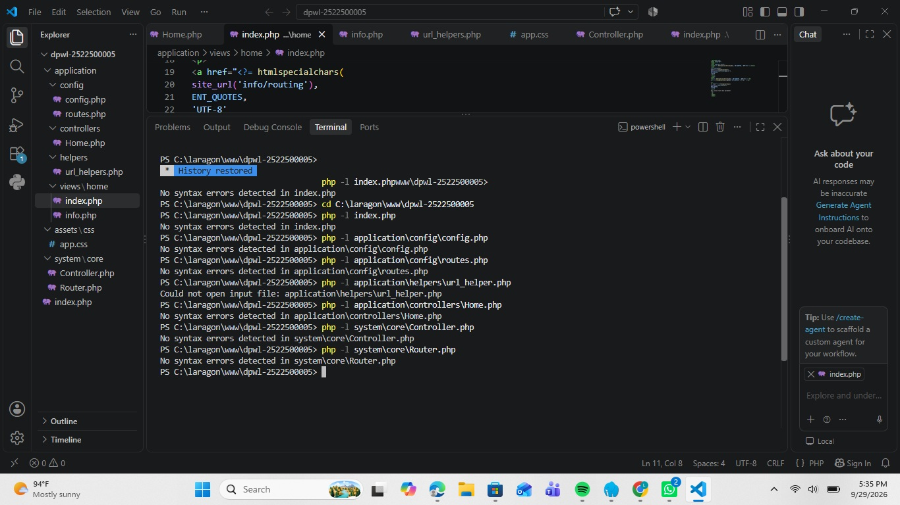
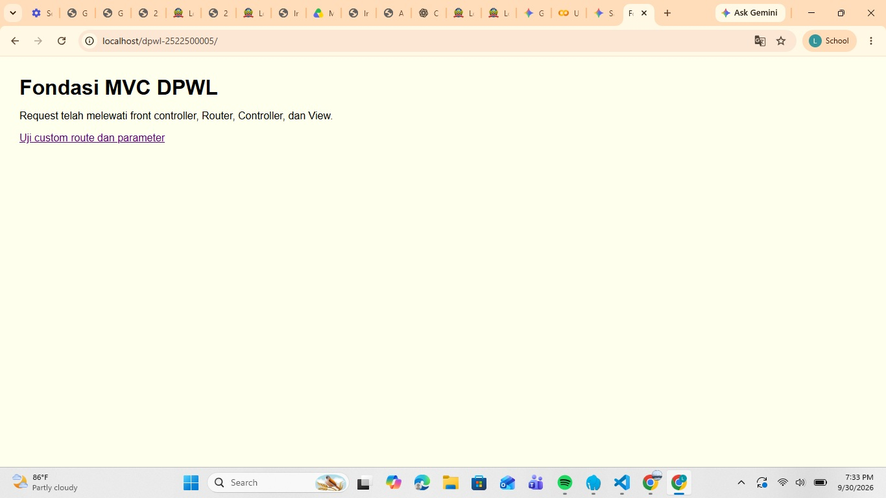
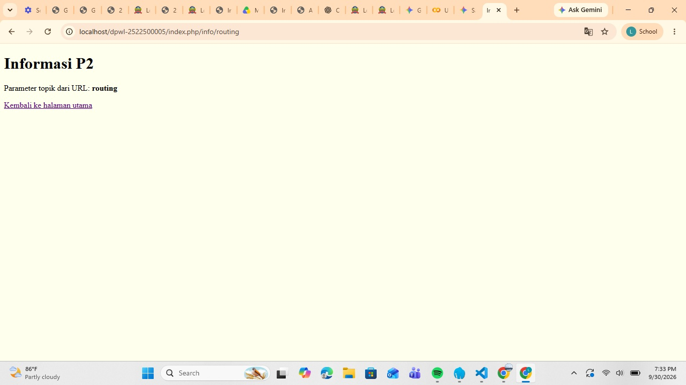

# pertemuan-02
## 1. Tujuan Praktikum
[Jelaskan tujuan P2 dengan kalimat sendiri.]
Praktikum ini bertujuan untuk merancang dan membangun fondasi aplikasi web dengan pola MVC buatan sendiri, memahami peran front controller, routing, Base URL, Helper, serta mampu menelusuri dan menjelaskan alur request-response.   
## 2. Struktur Direktori
[Tampilkan tree struktur P2 dan jelaskan fungsi setiap bagian.]
dpwl-NIM/
├── index.php
├── application/
│   ├── config/
│   │   ├── config.php
│   │   └── routes.php
│   ├── controllers/
│   │   └── Home.php
│   ├── helpers/
│   │   └── url_helper.php
│   └── views/
│       └── home/
│           ├── index.php
│           └── info.php
├── assets/
│   └── css/
│       └── app.css
└── system/
    └── core/
        ├── Controller.php
        └── Router.php

index.php (Root)   Fungsi: Berperan sebagai Front Controller dan merupakan satu-satunya titik masuk (single entry point) untuk seluruh request aplikasi.   Tugas: Mendefinisikan konstanta direktori (FCPATH, APPPATH, SYSPATH), memuat file konfigurasi, helper, class core, file pemetaan route, membaca URI dari request, lalu menyerahkannya ke Router.   
application/config/config.php   Fungsi: Menyimpan array konfigurasi dasar aplikasi.   Tugas: Menyimpan variabel seperti base_url (alamat utama aplikasi) dan index_page.   
application/config/routes.php   Fungsi: Menentukan aturan pemetaan (routing) URL kustom serta controller default.   Tugas: Menyimpan pemetaan dari pola URL/URI tertentu (misal: info/(:any)) ke Controller dan method tujuan (misal: home/info/$1).   
application/controllers/Home.php   Fungsi: Berperan sebagai Controller Aplikasi.   Tugas: Menangani logika aplikasi berdasarkan request URL, mengolah/menyiapkan data yang dibutuhkan, dan memanggil halaman tampilan (View) melalui method $this->view().   
application/helpers/url_helper.php   Fungsi: Berisi fungsi-fungsi pembantu (helper) untuk mengelola URL secara dinamis.   Tugas:base_url(): Menghasilkan URL lengkap menuju direktori utama/aset (CSS, JS, Gambar).   site_url(): Menghasilkan URL dinamis menuju route/halaman aplikasi melalui front controller (index.php).   
application/views/home/index.php   Fungsi: Berperan sebagai View (Tampilan Utama).   Tugas: Menyajikan antarmuka/HTML halaman utama aplikasi menggunakan data yang dikirimkan oleh Home::index().   
application/views/home/info.php   Fungsi: Berperan sebagai View (Tampilan Informasi).   Tugas: Menyajikan tampilan detail/informasi dan menampilkan parameter dinamis yang dikirim dari Controller Home::info($topik).           
## 3. Front controller
[Jelaskan peran index.php sebagai satu titik masuk aplikasi.]
index.php berperan sebagai Front Controller, yaitu satu titik masuk utama untuk seluruh permintaan dinamis aplikasi. Berkas ini bertugas mendefinisikan path, memuat konfigurasi, Helper, class core (Base Controller & Router), serta menyerahkan penanganan URI ke Router.
## 4. Routing dan Pemetaan URL
| URL/Route | Controller | Method | Parameter | View |
|---|---|---|---|---|
| / | Home | index | - | home/index.php |
| home/index | Home | index | - | home/index.php |
| home/info/mvc | Home | info | mvc | home/info.php |
| info/routing | Home | info | routing | home/info.php |
| sewa/mpbil/1 | Home | sewa | 1 | home/sewa.php |

Tambahkan satu baris untuk route hasil Tahap Modifikasi ATM yang dibuat berdasarkan objek atau konteks
aplikasi DPW, kemudian jelaskan pemetaan route → Controller → method → parameter → View.
URL atau Route (sewa/mobil/1) ditangkap oleh Router, dipetakan ke Controller (Home) mengeksekusi method (sewa) dengan mengirimkan parameter nilai (1) lalu Controller memanggil View (home/sewa.php) untuk menampilkan datanya.
## 5. Base URL dan Helper
Jelaskan fungsi base_url() dan site_url(), kemudian berikan contoh penggunaannya pada implementasi P2:
- base_url() untuk memanggil assets/css/app.css;
- site_url() untuk membentuk URL navigasi/route aplikasi.
base_url(): Membentuk URL dasar lokasi aplikasi untuk memanggil aset statis.   Contoh: base_url('assets/css/app.css') menghasilkan http://localhost/dpwl-2522500005/assets/css/app.css.   
site_url(): Membentuk URL lokasi navigasi/route dinamis melalui front controller.   Contoh: site_url('info/routing') menghasilkan http://localhost/dpwl-2522500005/index.php/info/routing.  
## 6. Alur Request-response
Jelaskan dua alur berikut:
1. Alur eksekusi aktual P2:
Browser → index.php → Router → Controller → View → Response.
2. Posisi Model dalam arsitektur MVC lengkap:
Browser → index.php → Router → Controller → Model → basis data/data → Model → Controller → View →
Response.
Pada implementasi P2, Model belum digunakan karena akses dan pengelolaan basis data mulai
diimplementasikan pada P3.
## 7. Hasil Pengujian dan Debugging
### Gambar 1. Hasil Pengujian debugging

## 8. Bukti Tangkapan Layar
Sisipkan gambar yang relevan dari folder dokumentasi/ dengan perintah:
### Gambar 1. Hasil Pengujian Halaman Utama

### Gambar 2. Hasil Pengujian Custom Route

## 9. Kesimpulan P2
Jelaskan apa yang sudah dapat dilakukan kerangka MVC dan apa yang baru akan ditambahkan pada P3.
Kerangka MVC P2 Saat Ini: Sudah mampu mengarahkan permintaan melalui satu titik masuk (front controller), melakukan pemetaan URL kustom melalui Router, mengorganisasi Controller dan View, serta memanfaatkan Helper untuk Base URL dan aset.  
 Penambahan pada P3: Penggunaan Model, koneksi ke basis data MySQL (MySQLi/prepared statement), fitur autentikasi, pengelolaan sesi, kontrol akses, dan integrasi antarmuka AdminLTE.